# Revit Panel

    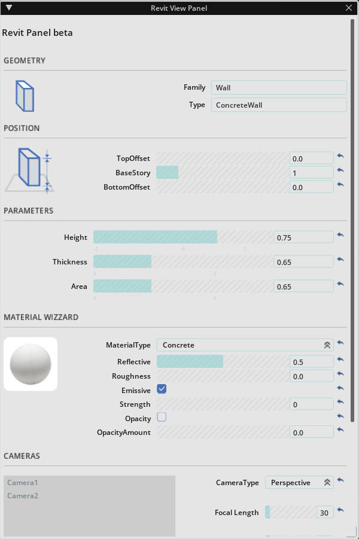

This plug-in is the UI part of the property view panel of usd files imported through Revit Connector, integrating key information in BIM files to facilitate AEC professionals to create, edit, manage and view usd scenes exported by BIM software conveniently.
The panel contains custom controls with initial values and is divided into the following sections.

## Geometry

    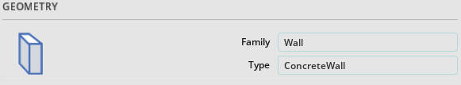

The usd scene imported into Revit file through Connector contains the following contents, and the BIM information structure is shown below in the Stage:

    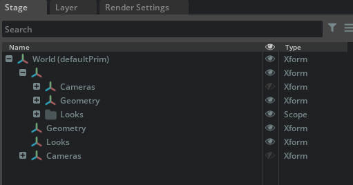

* `Cameras`: Camera views in the file. Include camera properties.
* `Geometry`: Mesh models in the file. 
* `Looks`： Materials in the file.

The information in the BIM model is presented in the Geometry hierarchy in the following structure:

    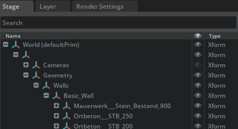

* `Family`
    * `Type`:
        * `Object`

For example:

* `Walls`
    * `Basic_wall`
        * `Basic_wall_1122033`

In the Geometry section, **Family** and **Type** of the selected object will be read into the corresponding property column respectively, and different editing panels will be switched based on the selected Family.

    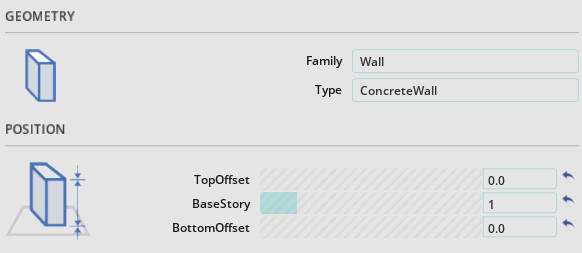
    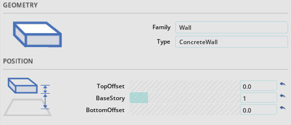
    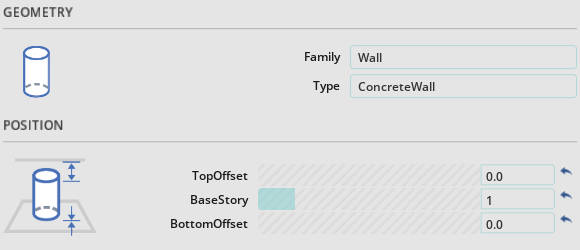

## Position

    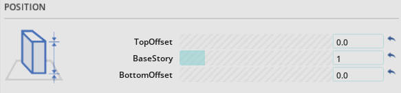

Take the wall as an example, expose the **BaseStory**, **TopOffset**, **BottomOffset** by reading the corresponding properties in the BIM model to adjust the component's position between layers.

* `TopOffset` : The top offset of the component based on the floor height
* `BaseStory` : The base story where the component is located, set by the subsequent development of the USD
* `BottomOffset`：The bottom offset of the component based on the story where it is located

## Parameters

    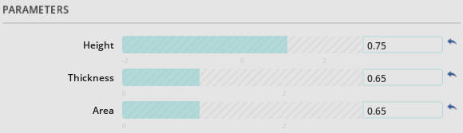

By reading the basic drawing element information of the components in the BIM model, taking the wall as an example, i.e. height, thickness, area information：

* `Height` : Wall height, usually determined by floor height with top and bottom offset
* `Thickness` : Wall thickness
* `Area`：Surface area of the wall, usually the area of the largest face

## Material Wizard

For AEC industry professionals, simplify the process of designing materials, pre-design common building material materials based on MTL, and expose some key parameters for customization possibilities.

    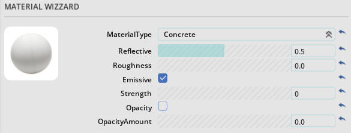

* `MaterialType` : Pre-designed materials based on MTL, including common types of architecture materials
* `Reflective` : The reflective of the material
* `Roughness`：The roughness of the material
* `Emissive`：Decide whether the material is self-luminous or not
* `Strength`：Material self-illumination intensity
* `Opacity`：Decide whether the material is transparent or not
* `Opacity`：Material transparency amount

## Cameras

Read the imported camera lens and expose simple parameters for adjustment without adjusting the camera position to retain the certain scene within the original BIM file

    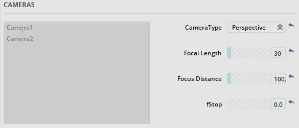

* Left:
    * `CameraList` : List of imported cameras to choose from
* Right：
    * `CameraType` : Camera projection method, perspective or orthogonal
    * `Focal Length`：The shorter the focal length of the lens, the larger the framing range; conversely, the longer the focal length of the lens, the smaller the framing range
    * `Focus Distance`：Distance from the subject to the focus plane of the camera
    * `fStop`：No depth-of-field effect when fStop=0, the smaller the depth-of-field effect when >0, the stronger the depth-of-field effect, meanwhile adjusting the focus distance to make the subject is in focus

## Environment

Simple settings for the environment, mainly for the sun position settings to provide realistic ambient lighting.

    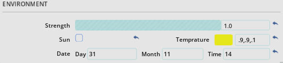

* `Strength` : Environmental light intensity
* `Sun` : Whether to turn on the real sun, based on date and time
* `Temperature`：Color temperature, valid when Real Sun is unchecked
* `Date`：Real Sun Date and Time Settings

## Installation

This install guide of this extension.

    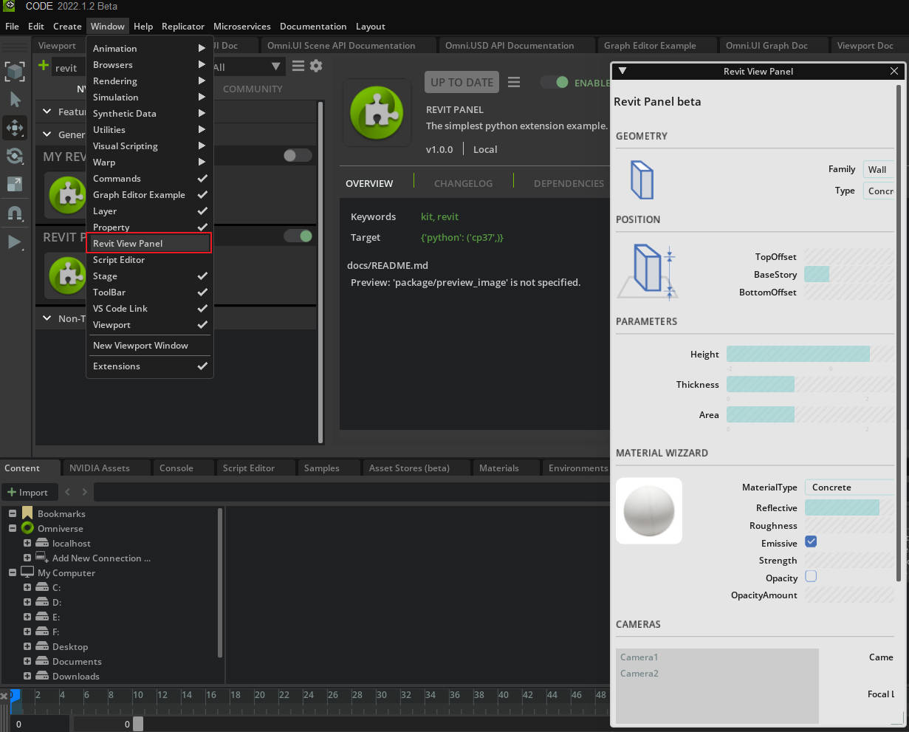

Look for "revit_panel" extension in extension manager and enable it. This panel will pop up. In case you close this panel, you can also re-open it within Window menu.
